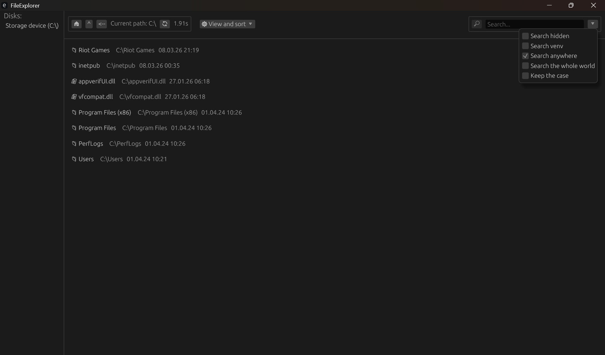

[Читать на русском](README.ru.md)

# FileExplorer
A fast and lightweight desktop file manager.

## Features
* High performance
* Ability to work with other disks
* Instant customizable file search
* Opening, deletion and sorting of files by various parameters
* Minimalistic UI

## Architecture
* **UI** based on the `egui` library 
* **Core logic** written in pure Rust (file system operations and indexing)

## Roadmap
- [ ] Other basic file operations (creating new files, copy, move, rename)
- [ ] Application caching, so that you don’t have to index file every time you launch
- [ ] Customizable UI and color themes

---

## Usage

### For users
1. Go to the [Releases](https://github.com/vladislvd/FileExplorer/releases) section.
2. Download the `Explorer.zip` archive from the last version.
3. Unpack the archive and run the `exe` file.

### For developers

#### Requirements
* **[Rust](https://rust-lang.org/)** - actual stable version.
* **C++ Build Tools** - they come with Visual Studio or Build Tools for VS. When you install Rust using `rustup`, it will prompt you to download the Visual Studio Installer and check the box next to `Desktop development with C++`.
### Build and run
1. Clone the repository:
```bash
git clone https://github.com/vladislvd/FileExplorer.git
```
2. Go to the project directory:
```bash
cd FileExplorer
```
3. Run the project in development mode:
```bash
cargo run
```
or in release mode:
```bash
cargo run --release
```
3. Compiled executable files will be located in the `target/debug/` or `target/release/` directory accordingly.

---
## Screenshots
